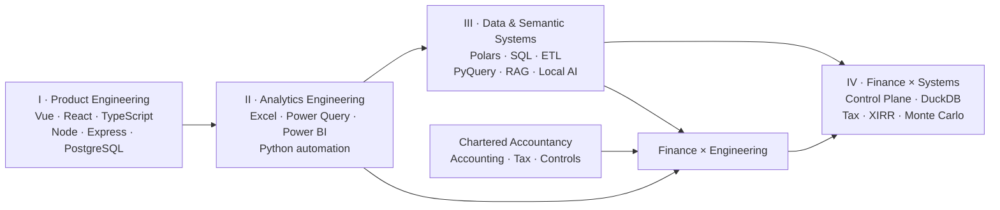

# Shan.tk 👋

### Sudharshan TK · Chartered Accountant × Data Engineer × Software Builder

**Finance → Data → Systems → Decisions**

I build systems that turn messy financial and operational data into
**reconciled state, reusable data infrastructure, and decision-ready
analytics**.

  

------------------------------------------------------------------------

## 🧭 How the side quests became systems

I started with the web, moved into full-stack products, found Python
through analytics, and kept following the data until the side quests
became engines. Somewhere along the way, Chartered Accountancy and
software engineering stopped being separate tracks. 😄

**Build products → engineer data → model semantics → reconstruct
financial truth.**

------------------------------------------------------------------------

## 🚀 Flagship Systems

<table>
<tr>
<td width="50%" valign="top">

### 💸 [Personal Finance ETL](https://github.com/tks18/personal-finance-etl)

**A local-first financial data platform.**

Reconstructs fragmented financial evidence into reconciled household and
investment state, then carries that state through analytics, tax,
planning, and BI.

**Data engineering**  
`SQLite Control Plane` · `DuckDB` · `Polars` · `20 Silver` · `17 Gold`

**Finance & quant**  
`FIFO Tax Lots` · `XIRR` · `Shadow Benchmarks` · `After-Tax Wealth` ·
`Monte Carlo FIRE`

**Product surface**  
`Power BI` · `CLI` · `Desktop` · `Packaged Docs`

**Explore:** [Repo](https://github.com/tks18/personal-finance-etl) ·
[Wiki](https://github.com/tks18/personal-finance-etl/wiki) ·
[Docs](https://github.com/tks18/personal-finance-etl/blob/master/docs/README.md)
· [PyPI](https://pypi.org/project/personal-finance-etl/)

</td>
<td width="50%" valign="top">

### ⚡ [PyQuery](https://github.com/PyQuery-HQ)

**Python-native data execution systems.**

What began as Power Query-style transformation tooling evolved into
reusable local-first data infrastructure.

**Current direction**  
`Polars-first` · `Typed` · `Deterministic` · `Plugin-driven`

**System evolution**  
`Lazy Execution` · `Large-file Workflows` · `CLI` · `UI` · `API` · `SDK`

**What it represents**  
Reusable transformation machinery instead of one-off scripts.

**Explore:** [HQ](https://github.com/PyQuery-HQ) ·
[Core](https://github.com/PyQuery-HQ/pyquery-core) ·
[Legacy](https://github.com/PyQuery-HQ/pyquery-legacy)

</td>
</tr>
</table>

------------------------------------------------------------------------

## 🧩 Selected Engineering Work

<table>
<tr>
<td width="50%" valign="top">

### 🧠 [pbi-to-sql](https://github.com/tks18/pbi-to-sql)

**Power BI semantics → reusable data infrastructure**

Extracts a Power BI semantic model, reconstructs it in relational SQL,
and layers local semantic/RAG capabilities over that state.

`TMDL` · `SQLite` · `LangChain` · `Ollama` · `RAG`

</td>
<td width="50%" valign="top">

### 📊 [xlwings-excel-api](https://github.com/tks18/xlwings-excel-api)

**Python engineering inside real Excel workflows**

A modular Python × Excel × VBA framework for UDFs, query helpers, Power
Query functions, and reusable analytics utilities.

`Python` · `xlwings` · `VBA` · `Power Query` · `Power BI`

</td>
</tr>
<tr>
<td width="50%" valign="top">

### 🧪 [Shan's Dataverse](https://github.com/tks18/streamlit-synthetic-data)

**Analytics engineering turned into a product**

An interactive synthetic-data workbench for finance and operations POCs,
dashboard testing, modelling, and prototyping without exposing real
client data.

`Streamlit` · `Schema Builder` · `Vectorized Formulas` ·
`AST Validation` · `Reusable Profiles`

</td>
<td width="50%" valign="top">

### 🧠 [open-memory-lane](https://github.com/tks18/open-memory-lane)

**A local systems-engineering side quest**

An open-source, memory-conscious take on Windows Recall built around
local multimedia processing.

`Python` · `OpenCV` · `FFmpeg` · `Local-first`

</td>
</tr>
</table>

Also in the analytics tooling lane:
<a href="https://github.com/tks18/xl-pq-handler"><b>xl-pq-handler</b></a>,
built around managing Power Query assets as maintainable engineering
artifacts.

------------------------------------------------------------------------

## 🌱 Before the Data Engines

<table>
<tr>
<td width="50%" valign="top">

### 🌐 [gindex-v4](https://github.com/tks18/gindex-v4)

A Vue-based Google Drive indexing product with backend services,
authentication, role-based access control, MongoDB, media handling, and
deployment tooling.

`Vue` · `Node.js` · `MongoDB` · `JWT`

**250+ stars · 230+ forks**

Open-source product engineering before data systems became the main
plot.

</td>
<td width="50%" valign="top">

### 💰 Finance Manager

A full-stack personal-finance application built across **400+ commits**
in separate frontend and backend repositories.

**[Frontend](https://github.com/tks18/finance-manager)**  
`React` · `TypeScript` · `Redux`

**[Backend](https://github.com/tks18/finance-manager-backend)**  
`Node.js` · `Express` · `PostgreSQL` · `Sequelize` · `JWT`

Where finance and product engineering first started sharing the same
codebase.

</td>
</tr>
</table>

------------------------------------------------------------------------

## 🧰 What I Build With

| I build around            | Toolkit / concepts                                                                          |
|---------------------------|---------------------------------------------------------------------------------------------|
| **Data systems**          | Python · Polars · DuckDB · SQLite · SQL · ETL · lazy execution · data contracts             |
| **Analytics & BI**        | Power BI · Power Query · Excel · DAX · semantic modelling · analytical marts                |
| **Product & full stack**  | TypeScript · React · Vue · Redux · Node.js · Express · REST · PostgreSQL · MongoDB          |
| **Software engineering**  | Pydantic · OOP · clean architecture · APIs · CLI · desktop apps · testing · strict typing   |
| **Finance & quant**       | Accounting · reconciliation · tax · FIFO · XIRR · portfolio analytics · Monte Carlo         |
| **Analytics products**    | Streamlit · synthetic data · schema builders · formula engines · safe expression evaluation |
| **AI / semantic systems** | LangChain · RAG · Ollama · local LLM workflows · semantic metadata                          |

> **Chartered Accountancy is the domain lens, not a decorative
> credential.** It shows up in how I think about evidence,
> reconciliation, controls, tax, grain, and financial semantics.

------------------------------------------------------------------------

## 🏆 Okay, a Little GitHub Flex

  

Stats are fun. Projects are the receipts.

------------------------------------------------------------------------

## 🤝 Connect

  

**Finance gave me the questions. Data gave me the structure. Software engineering let me build the answers.**

